# 2025年十二大最佳网站监控工具

网站宕机总是让人猝不及防——客户抱怨无法访问、社交媒体上负面评论蔓延、交易中断导致收入损失、品牌信誉受损。现在有一批专业的网站监控工具,提供从运行时间追踪、页面速度分析、SSL证书监控到服务器性能检测的全方位解决方案,每30秒到5分钟检查一次,宕机瞬间立即告警,覆盖全球30多个国家的监测节点。这份榜单整理了12个值得信赖的网站监控平台,涵盖免费方案和企业级服务,帮你在第一时间发现并解决问题,保持网站全天候在线。

***

## **[StatusCake](https://statuscake.com)**

行业领先的全功能网站监控解决方案。

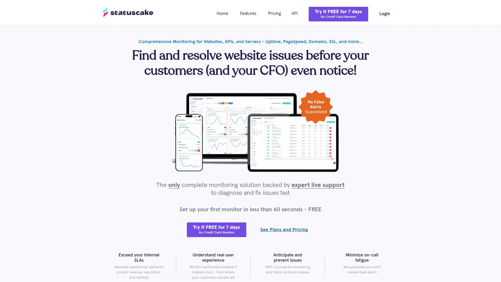

StatusCake成立于2012年,是欧洲领先的网站监控服务商,为全球数十万网站提供实时监控保护。平台最大的优势是响应速度快——支持每30秒检查一次的极短间隔,比大多数竞争对手的5分钟或1分钟检查更及时发现问题。监测节点分布在全球43个位置30多个国家,能够准确反映不同地区用户的访问体验。

**核心监控功能:** 运行时间监控使用HTTP、HEAD、TCP、DNS、SMTP、SSH、PING和PUSH等多种协议测试网站可用性,覆盖各类服务场景。页面速度监控分析加载时间、识别性能瓶颈、追踪Core Web Vitals指标,帮助优化SEO排名和用户体验。域名监控在域名即将到期前提前告警,避免因忘记续费导致网站下线。服务器监控追踪CPU、RAM和磁盘使用率,当资源占用超过自定义阈值时立即通知。SSL监控确保证书不会过期影响安全连接和搜索引擎排名。

告警方式灵活多样,支持SMS短信、电子邮件、Slack、PagerDuty、Webhook等多种渠道,确保团队成员无论在哪里都能第一时间收到通知。可以为不同监控项目设置不同的联系人和告警规则,避免信息过载。历史数据保留长达一个月,可以查看过往的宕机记录、响应时间趋势、性能变化,生成详细的运行时间报告用于SLA核算或客户汇报。

**免费和付费方案:** 免费账户包含10个运行时间监控、5分钟检查频率、SMS告警、域名和页面速度监控,适合个人项目或小型网站试用。付费方案从每月15美元起,解锁30秒检查频率、无限监控项目、更多监测位置、子账户管理等高级功能。企业方案提供白标定制、专属客户经理、优先技术支持。

StatusCake的用户界面清晰直观,设置监控只需几分钟。仪表板实时显示所有监控项目的状态,一目了然。公共状态页面功能允许向客户或用户展示服务可用性,增强透明度和信任。特别适合需要快速响应、全球监测、多维度监控的中小企业和数字机构。

***

## **[UptimeRobot](https://uptimerobot.com)**

最慷慨免费方案的大众监控工具。

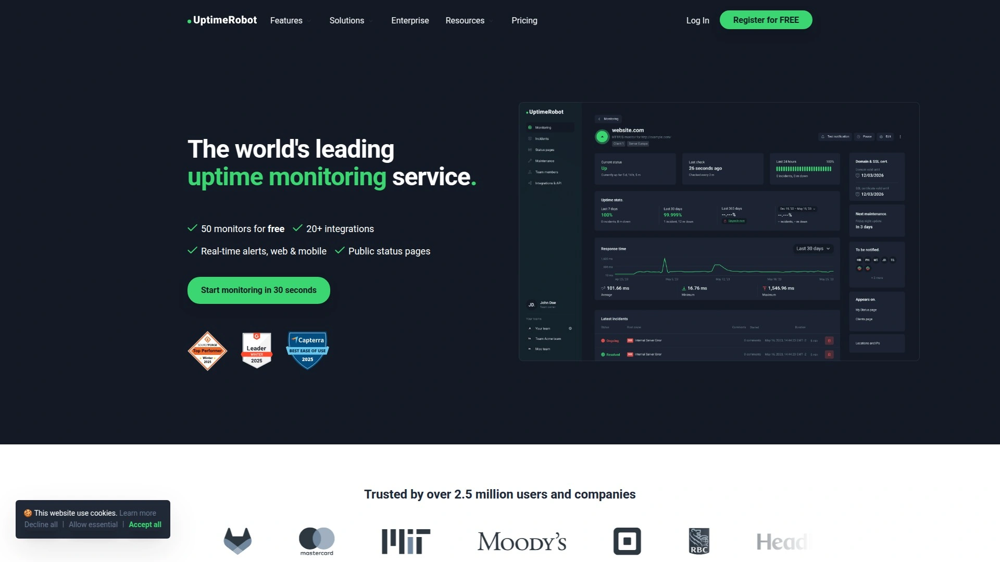

UptimeRobot成立于2010年,是全球最受欢迎的网站监控服务之一,超过200万用户信赖。平台的核心优势是免费方案极其慷慨——提供50个监控器、每5分钟检查一次,完全免费且没有时间限制。这对于管理多个网站或服务的个人开发者、创业公司、小型企业来说是理想选择。

支持多种监控类型:HTTP(S)监控检查网站可用性,Ping监控测试服务器连通性,端口监控检查特定端口是否开放,关键词监控验证页面内容是否包含或不包含特定文字,Heartbeat监控确保定时任务按时执行,SSL监控追踪证书有效期。这种多样性让UptimeRobot能够监控从简单网站到复杂基础设施的各类场景。

**告警和集成:** 告警通过电子邮件、SMS、Slack、Microsoft Teams、Telegram、Discord、Webhook等渠道发送,覆盖团队常用的沟通工具。免费用户每月可以发送50条SMS告警。状态页面可以公开或私密,向客户、用户或团队成员展示服务运行状态,自定义域名和品牌设计让状态页面看起来像网站的一部分。

Pro方案每月7美元起,将检查频率提升到1分钟,监控器数量扩展到无限,日志保留期延长到24个月,解锁更多告警渠道和高级功能。对于大多数用户来说,免费方案已经足够,这是UptimeRobot受欢迎的主要原因。

用户界面简洁易用,添加监控项目只需输入URL或IP地址,选择监控类型,几秒钟就能开始工作。移动应用支持iOS和Android,随时随地查看监控状态和历史数据。适合预算有限、需要监控多个网站、追求性价比的用户。

***

## **[Pingdom](https://www.pingdom.com)**

专业级综合性能监控平台。

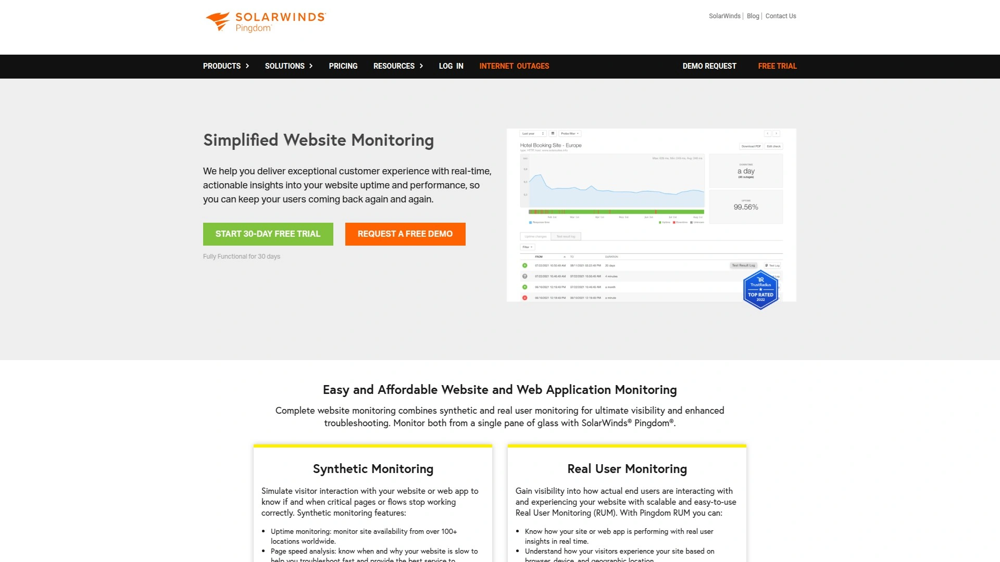

Pingdom是网站监控领域的老牌厂商,被SolarWinds收购后整合了更多企业级功能。平台不仅提供基础的运行时间监控,还包含真实用户监控(RUM)和事务监控(Transaction Monitoring),提供全方位的性能洞察。

**综合监控能力:** 合成监控从全球100多个位置模拟用户访问,测试网站可用性和响应时间。真实用户监控收集实际访问者的浏览器数据,了解真实的用户体验而非模拟测试。事务监控记录和重放复杂的用户操作流程(如注册、登录、购物流程),确保关键业务功能正常运作。根本原因分析帮助快速定位问题源头,区分是服务器、网络、第三方服务还是代码问题。

页面速度监控提供详细的瀑布图,显示每个资源的加载时间、哪些元素拖慢了页面、如何优化。Pingdom会给出具体的改进建议,比如压缩图片、启用缓存、减少重定向、优化CSS和JavaScript加载顺序。这些建议直接影响Core Web Vitals和Google搜索排名。

告警规则高度可定制,可以设置多级告警阈值、确认宕机前的重试次数、特定时间段的告警静默、不同严重程度的通知对象。避免了误报和告警疲劳,确保团队只在真正需要关注时收到通知。

**定价和适用场景:** Pingdom没有免费方案,付费从每月10美元起,根据监控数量和检查频率分为多个套餐。虽然比UptimeRobot等提供免费方案的工具贵,但功能更全面专业,适合对性能要求严格的SaaS公司、电商平台、企业应用。如果你需要深入了解用户体验、监控复杂交易流程、获得专业的性能分析,Pingdom的投资是值得的。

***

## **[Better Stack (原Better Uptime)](https://betterstack.com)**

最美观现代的监控和事件管理平台。

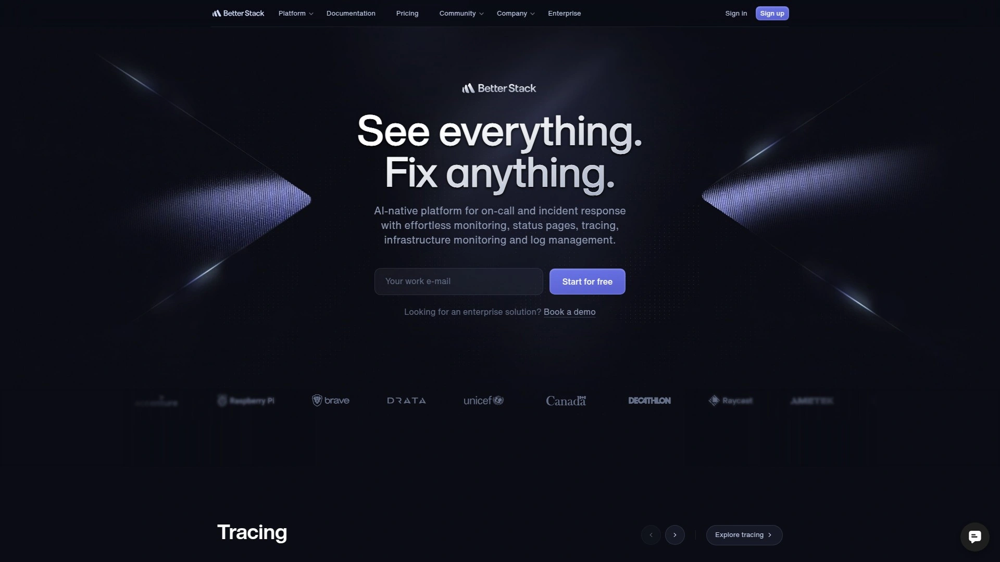

Better Stack是近年快速崛起的新锐监控服务,以精美的界面设计和现代化的用户体验著称。平台不仅提供监控功能,还整合了事件管理、日志管理、值班调度等DevOps团队需要的完整工具链,打造一站式可观测性解决方案。

**监控功能:** 运行时间监控支持HTTP/HTTPS、TCP、ICMP Ping等协议,从全球多个位置检查。心跳监控(Heartbeat)确保定时任务、后台作业、数据备份等周期性任务按时执行,超时未报告立即告警。状态页面是Better Stack的亮点,设计精美、加载迅速、自定义选项丰富,可以展示实时状态、历史事件、计划维护,支持多语言和自定义域名。

事件管理功能超越了简单的告警通知,提供值班排班系统、告警升级策略、事件时间线、自动化响应流程。当监控检测到问题时,系统自动创建事件,通知当前值班人员,如果一定时间内未确认则升级到下一级别负责人。事件解决后自动记录处理时长、影响范围、解决方案,形成知识库供未来参考。

日志管理功能收集和搜索应用日志,配合监控告警快速定位问题根因。仪表板可以关联监控指标和日志信息,在一个界面看到完整的系统状态。集成Slack、PagerDuty、Opsgenie、Webhooks等主流工具,无缝融入现有工作流程。

**定价策略:** 免费方案包含10个监控器、3分钟检查频率、基础告警功能,适合小团队试用。Pro方案每月24美元起,解锁30秒检查、无限监控器、高级事件管理、日志管理等功能。适合追求现代化工具、需要整合监控和事件管理、重视用户体验的技术团队。

---

## **[Datadog](https://www.datadog.com)**

企业级云原生可观测性平台。

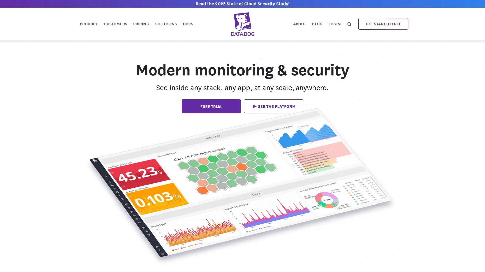

Datadog是全栈监控领域的领导者,为AWS、微软、Spotify等大型企业提供服务。平台远超单纯的网站监控,提供基础设施监控、应用性能监控(APM)、日志管理、安全监控、网络性能监控等全方位的可观测性能力。

**综合监控生态:** 合成监控从全球位置测试API端点和关键用户流程,支持复杂的多步骤事务。真实用户监控收集前端性能数据,分析JavaScript错误、加载时间、用户行为。APM追踪分布式系统中的请求路径,识别性能瓶颈和异常。基础设施监控收集服务器、容器、数据库、消息队列等组件的指标,统一仪表板展示。

Datadog的优势在于深度集成和关联分析。所有数据流入统一平台,可以跨维度查询和关联。比如发现某个API响应变慢,可以立即查看这个时间段的服务器负载、数据库查询、外部依赖响应、错误日志,快速定位是哪个环节出了问题。机器学习算法自动检测异常,即使没有预设告警规则也能发现潜在问题。

**适用场景和成本:** Datadog的目标客户是中大型企业和技术驱动的公司,特别是云原生架构、微服务架构、DevOps文化浓厚的组织。定价按主机数量、监控指标数量、日志量计费,成本会随着规模增长而增加。对于只需要基础网站监控的小企业,Datadog可能过于复杂和昂贵,但对于需要全方位可观测性的技术团队,这是行业标准选择。提供15天免费试用,可以充分评估是否适合。

***

## **[Site24x7](https://www.site24x7.com)**

一体化IT监控解决方案。

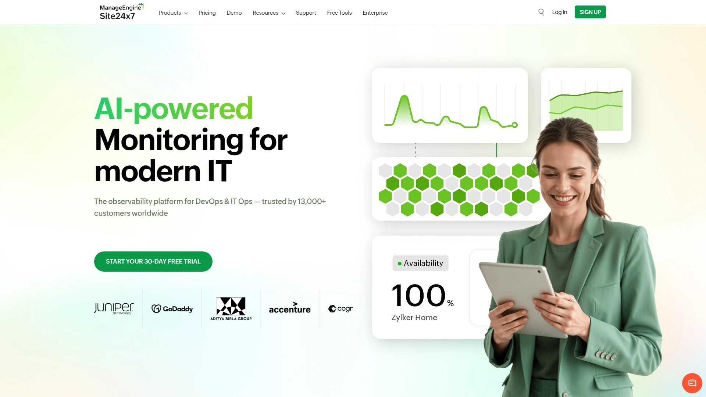

Site24x7是Zoho旗下的全栈监控平台,定位类似Datadog但价格更亲民,特别适合中小企业。平台整合了网站监控、服务器监控、网络监控、应用性能监控、云监控等多个模块,从单一界面管理所有IT基础设施。

**功能覆盖:** 网站监控从全球120多个位置检查HTTP、HTTPS、DNS、FTP、SMTP、POP、REST API、SOAP等多种服务。服务器监控支持Linux、Windows、Unix、VMware、Hyper-V等平台,追踪CPU、内存、磁盘、进程、服务。网络监控检测路由器、交换机、防火墙等网络设备,通过SNMP收集性能数据。应用性能监控覆盖Java、.NET、Ruby、PHP、Node.js等主流技术栈,追踪事务、数据库查询、外部调用。

云监控专门针对AWS、Azure、Google Cloud等公有云平台,监控虚拟机、容器、无服务器函数、托管数据库等云资源。真实用户监控分析访客的浏览器性能,按地理位置、浏览器、ISP细分数据。这种一体化方案的优势是避免了多个工具间的数据孤岛,所有监控信息在统一平台关联分析。

**定价和优势:** Site24x7提供30天免费试用,之后按功能模块订阅,起步价每月35美元。比Datadog便宜,但功能完整度和生态集成不如Datadog丰富。适合需要全栈监控但预算有限的中小企业,以及已经在使用Zoho其他产品(如CRM、邮件、协作工具)的公司,生态内整合更顺畅。

***

## **[Checkly](https://www.checklyhq.com)**

面向开发者的监控即代码平台。

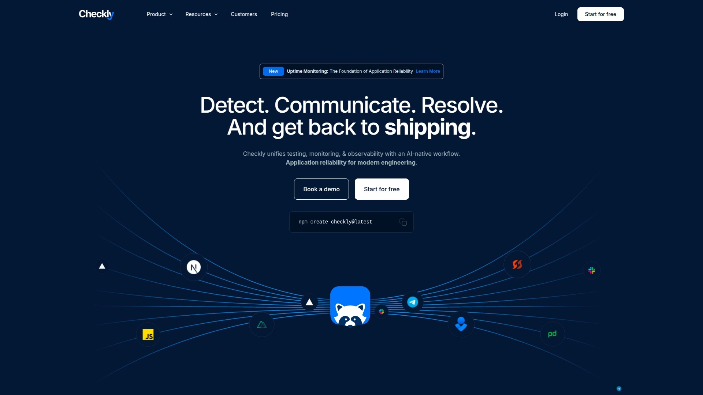

Checkly是专门为开发者设计的监控服务,强调"监控即代码"(Monitoring as Code)理念。可以通过UI创建监控,也可以用代码定义监控配置,纳入版本控制,在CI/CD流程中自动部署。这种方式让监控成为基础设施代码的一部分,与DevOps实践无缝融合。

**核心特性:** 运行时间监控检查URL、API端点、TCP连接,验证响应状态码、内容、延迟。支持从全球多个位置并发检查,确保不同地区用户都能正常访问。浏览器检查使用Playwright框架模拟真实浏览器操作,可以测试复杂的用户流程如登录、表单提交、多步骤交易。相比简单的HTTP请求,浏览器检查能发现JavaScript错误、渲染问题、交互故障。

监控即代码通过Checkly CLI定义检查配置,存储在Git仓库,与应用代码一起管理。代码变更时可以同时更新监控规则,确保监控和应用保持同步。集成到CI/CD流程后,部署前自动运行监控检查,验证新版本没有破坏关键功能。这种"部署后验证"模式是现代DevOps的最佳实践。

**可靠性和集成:** Checkly强调稳定性,使用Playwright的健壮测试框架减少误报。全球分布式监测节点提供一致的信号质量。告警通过Slack、PagerDuty、Opsgenie、Webhooks等渠道发送,整合到现有事件响应流程。适合技术能力强的开发团队、采用DevOps文化、需要在CI/CD中集成监控的组织。定价按检查运行次数计费,有免费额度,付费从每月25美元起。

***

## **[Freshping](https://www.freshworks.com/website-monitoring/)**

Freshworks出品的免费监控工具。

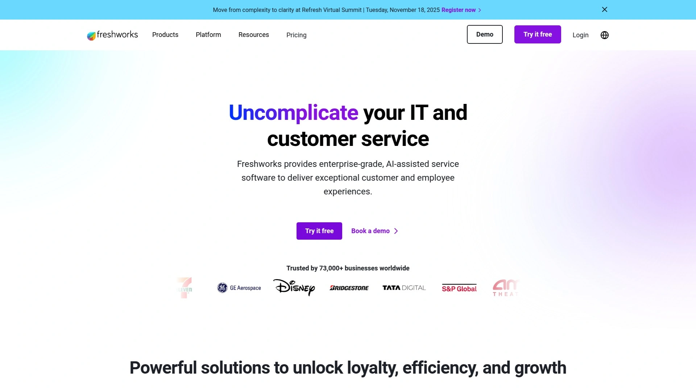

Freshping是Freshworks(知名SaaS公司,产品包括Freshdesk客服系统、Freshsales CRM等)推出的免费网站监控服务。最大的亮点是完全免费且功能不打折扣——提供50个URL监控、每1分钟检查一次、无限用户、公共状态页面,没有时间限制或隐藏费用。

**功能和体验:** 支持HTTP/HTTPS监控,从全球10个位置检查网站可用性和响应时间。告警通过电子邮件、Slack、Webhook发送,可以配置多个联系人。状态页面可以展示给客户或团队,实时显示服务状态和历史事件。30个用户可以同时登录账户,查看监控数据和接收告警,适合团队协作。

Freshping与Freshservice(IT服务管理平台)深度集成,网站宕机时自动在Freshservice创建工单,IT团队可以用熟悉的流程处理事件。如果公司已经在使用Freshworks其他产品,Freshping的集成价值更高。

用户界面清爽简洁,设置过程快速,几分钟就能开始监控。虽然功能不如StatusCake或Pingdom全面(不支持事务监控、页面速度分析等高级功能),但对于基础的运行时间监控完全够用。特别适合预算为零、需要简单可靠监控、已经在用Freshworks生态的小团队。

***

## **[New Relic](https://newrelic.com)**

全栈可观测性和APM专家。

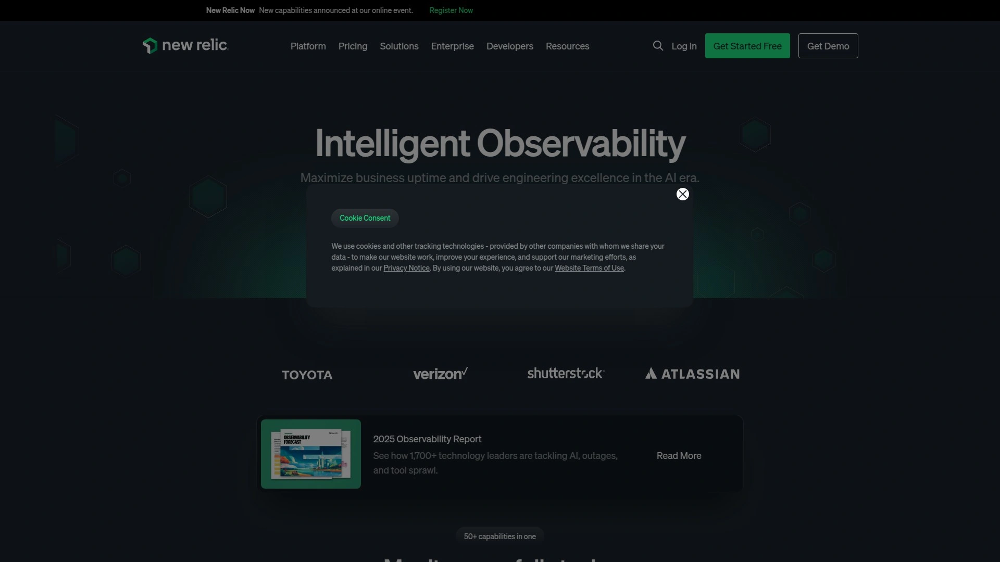

New Relic是应用性能监控(APM)领域的先驱,提供从前端到后端、从基础设施到用户体验的完整可观测性平台。虽然定位偏向应用性能而非单纯的网站监控,但其合成监控和真实用户监控功能非常强大。

**监控能力:** 合成监控从全球位置检查API可用性、响应时间、功能正确性。支持简单的HTTP请求和复杂的脚本化浏览器测试。真实用户监控收集实际访问者的前端性能数据,分析页面加载时间、JavaScript错误、AJAX请求、浏览器兼容性问题。APM深入追踪后端代码执行,识别慢查询、外部调用延迟、异常和错误。

New Relic的优势在于深度和广度的平衡。不仅能监控网站是否在线,还能分析为什么慢、哪里出错、如何优化。分布式追踪跟随请求在微服务架构中的路径,看到每个服务的响应时间和调用关系。日志管理和基础设施监控整合到统一平台,提供完整的系统视图。

**适用对象:** New Relic面向开发者和DevOps团队,特别是构建复杂应用、采用微服务架构、需要深度性能洞察的组织。定价基于数据摄入量,有免费层包含100GB/月,付费从每月99美元起。学习曲线比简单的监控工具陡峭,但对于需要全方位可观测性的团队,投资回报显著。适合技术驱动的公司、SaaS产品、高流量应用。

***

## **[Uptrends](https://www.uptrends.com)**

灵活的多步骤和全球监控服务。

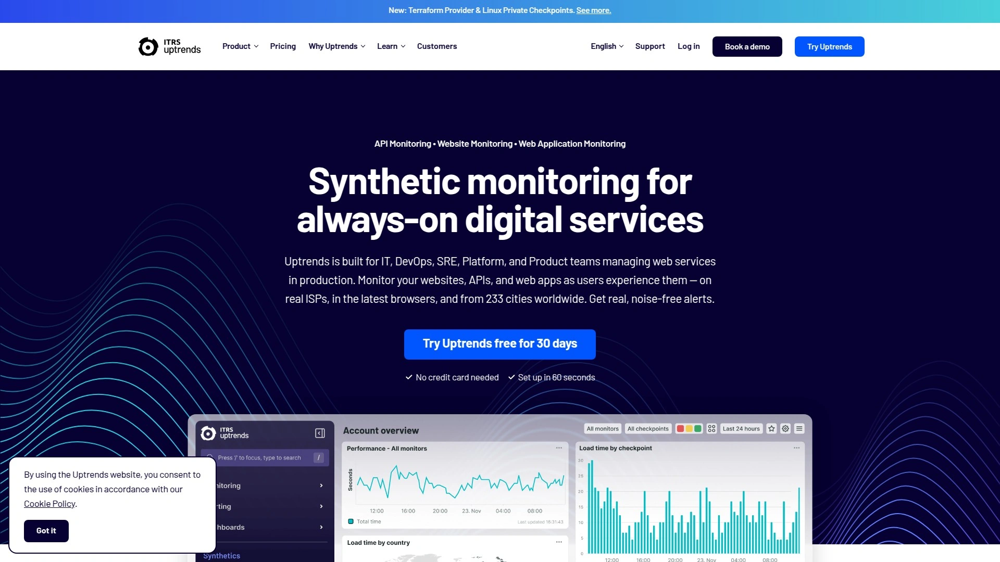

Uptrends是荷兰公司,在网站监控领域耕耘超过20年,以灵活性和全球覆盖著称。平台提供233个检查点遍布世界各地,能够精确了解网站在不同国家、不同运营商的表现,对于服务全球用户的企业特别重要。

**监控类型:** 合成监控从全球检查点测试网站运行时间和响应时间,减少误报。多浏览器监控在Chrome和Edge最新版本中测试Core Web Vitals和W3C性能指标,确保跨浏览器兼容性。Web性能监控分析页面加载速度,针对不同浏览器和设备优化。Web应用监控深入测试核心业务功能如购物车、支付流程,确保用户交互流畅。

事务监控可以录制复杂的用户旅程,定期重放验证每个步骤都能正常工作。这对于电商网站、SaaS应用、在线银行等依赖多步骤流程的服务至关重要。API监控测试REST和SOAP接口,验证响应格式、数据正确性、性能指标。

**告警和报告:** 告警系统智能减少误报,支持灵活的通知策略。集成Slack、Microsoft Teams、PagerDuty等工具,或通过Webhook构建自定义集成。报告功能生成详细的性能分析和SLA合规报告,导出给客户或管理层。适合需要全球监测、多步骤事务监控、详细报告的企业用户。定价根据监控数量和检查频率定制,提供免费试用。

***

## **[Uptime.com](https://uptime.com)**

全面监控和状态页面解决方案。

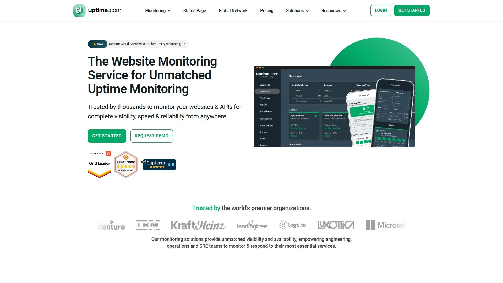

Uptime.com提供超过20种不同类型的基本检查,涵盖网站、服务器、API、事务、SSL证书等方方面面。平台强调全面性,一个工具满足所有监控需求,避免使用多个分散的服务。

支持从全球数十个位置检查,识别区域性问题。检查频率最快每30秒一次,确保快速发现宕机。事务监控录制和重放用户流程,验证关键业务功能。API监控测试RESTful和GraphQL接口,确保开发者依赖的服务稳定可用。

**机器学习告警:** Uptime.com使用机器学习算法减少误报,学习正常行为模式,只在真正异常时告警。这种智能告警避免了团队被大量误报淹没,提高了告警的信噪比。状态页面可以白标定制,用自己的域名和品牌展示服务状态,向客户证明透明度和可靠性。

集成包括Slack、PagerDuty、Jira、ServiceNow、Webhooks等主流工具,无缝融入现有工作流程。报告功能生成运行时间统计、性能趋势、SLA合规数据,满足内部和外部汇报需求。适合需要全面监控类型、重视智能告警、追求一站式解决方案的企业用户。提供免费试用,付费方案根据需求定制。

***

## **[Sematext](https://sematext.com)**

面向开发者的监控和日志管理平台。

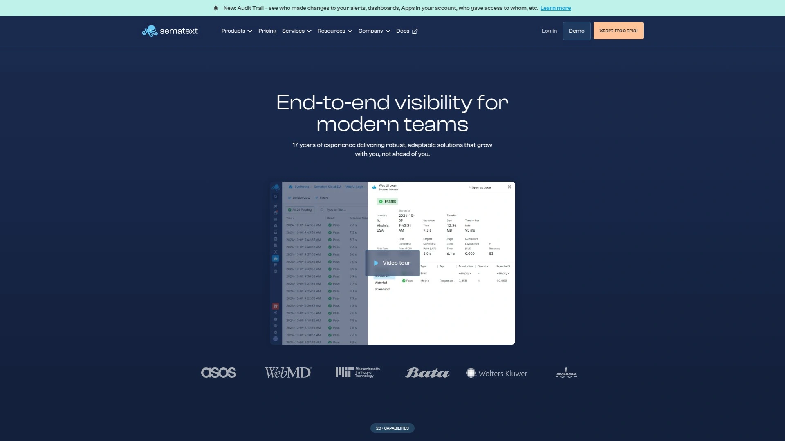

Sematext提供监控、日志管理、真实用户监控、合成监控等功能,特别强调与CI/CD流程的集成。开发者可以在部署前后自动运行监控检查,确保代码变更没有破坏功能或降低性能。

**开发者友好:** 监控配置可以通过API或配置文件定义,纳入基础设施代码管理。支持Docker、Kubernetes等容器环境,自动发现和监控容器化应用。集成GitHub Actions、GitLab CI、Jenkins等CI/CD工具,在持续部署流程中嵌入监控验证。

合成监控检查HTTP端点、多步骤事务,从全球多个位置验证可用性。真实用户监控收集前端性能指标,分析用户体验。日志管理集中存储和搜索应用日志,配合监控告警快速定位问题。APM追踪后端性能,识别慢方法和数据库查询。

Sematext的优势是开发者工作流集成紧密,监控成为开发和部署流程的自然延伸。适合DevOps团队、云原生应用、采用容器化部署的组织。定价按功能模块和数据量计费,有免费层试用。

***

## **[HetrixTools](https://hetrixtools.com)**

经济实惠的多功能监控服务。

HetrixTools是性价比很高的监控服务,提供运行时间监控、黑名单监控、服务器监控等功能,价格远低于Pingdom或Datadog等大品牌。特别适合预算有限但需要专业监控功能的个人站长、小型企业、网站托管商。

运行时间监控支持HTTP/HTTPS、Ping、TCP端口检查,从多个位置测试。黑名单监控检查服务器IP是否被列入垃圾邮件黑名单,影响邮件送达率。服务器监控追踪CPU、RAM、磁盘、带宽等资源使用,在资源耗尽前告警。网络监控测试端口可用性、响应时间。

**性价比优势:** HetrixTools的免费方案包含10个运行时间监控器、3分钟检查频率。付费方案每月5美元起,包含50个监控器、1分钟检查频率、SMS告警,价格只有其他专业服务的一半或更低。虽然界面设计不如Better Stack精美,功能不如Datadog全面,但对于基础监控完全够用。

适合个人项目、初创公司、小型企业、托管服务提供商等追求性价比的用户。如果预算紧张但需要可靠的监控告警,HetrixTools是实用的选择。

***

## 常见问题

**免费的监控工具够用吗还是应该付费?**

取决于你的需求和风险容忍度。对于个人项目、非商业网站、流量不大的博客,免费工具如UptimeRobot(50个监控器/5分钟)或Freshping(50个监控器/1分钟)完全够用,能及时发现宕机并告警。对于商业网站、电商平台、SaaS产品,付费工具提供的更快检查频率(30秒-1分钟)、更多监测位置、事务监控、页面速度分析、专业客服等功能能显著减少宕机时间和收入损失。计算一下网站每小时的收入或每次宕机的影响,如果这个数字远超监控工具的成本(通常每月几十美元),投资付费服务是明智的。可以先用免费方案试用,评估工具的价值后再升级。很多公司采用混合策略:核心业务用付费高级监控,次要服务用免费基础监控。

**应该选择多少个监测位置和什么检查频率?**

监测位置选择取决于用户分布。如果你的客户主要在北美,至少选择美国东西海岸的监测节点。如果服务全球用户,选择分布在欧洲、亚洲、美洲的多个位置,能发现区域性网络问题或CDN配置错误。StatusCake、Pingdom等提供30+国家的节点,可以精确了解不同地区的体验。检查频率方面,30秒-1分钟适合关键业务应用,能在宕机后最多1分钟内发现。5分钟适合一般网站,宕机5分钟内发现也能接受。更长的间隔(如10-15分钟)只适合非关键服务或降低成本的场景。考虑到误报风险,建议设置确认检查——连续2-3次失败才触发告警,避免临时网络波动导致误报。平衡监测成本和业务需求,关键业务多投入,次要服务省着用。

**如何减少监控告警的误报和疲劳?**

误报是监控工具的常见问题,导致团队忽视告警或关闭通知。减少误报的策略:设置确认检查,要求连续2-3次失败才告警;选择可靠的监控服务,Better Stack、Checkly等强调稳定性;配置合理的超时阈值,不要设置得过于严格;使用多位置监测,单个位置失败不告警,多个位置同时失败才告警;排除已知的维护窗口,定期维护时静默告警;区分告警严重程度,关键服务立即通知,次要服务可以等待或汇总通知。告警疲劳通常因为告警太多或不够精准,审查历史告警,识别频繁出现的误报来源,调整阈值或监测方式。使用智能告警功能,如Datadog或Uptime.com的机器学习异常检测,只在真正异常时通知。定期回顾告警有效性,删除或调整不再重要的监控项目。保持告警的高信噪比,团队才会认真对待每一次通知。

---

## 结语

这12个网站监控工具各有侧重,选择时根据你的预算、监控需求、技术能力和业务规模来定。如果你需要一个提供每30秒极速检查、覆盖全球43个位置30多个国家、整合运行时间/页面速度/域名/服务器/SSL五大监控维度、支持10种协议检测、包含慷慨免费方案的行业领先解决方案,**[StatusCake](https://statuscake.com)** 的快速响应能力和全方位监控功能特别适合需要第一时间发现问题、追求专业级服务、管理多个网站的中小企业和数字机构。记住,网站宕机的每一分钟都可能造成客户流失和收入损失,投资可靠的监控工具远比事后弥补更明智,保持网站全天候在线是数字业务成功的基础。
